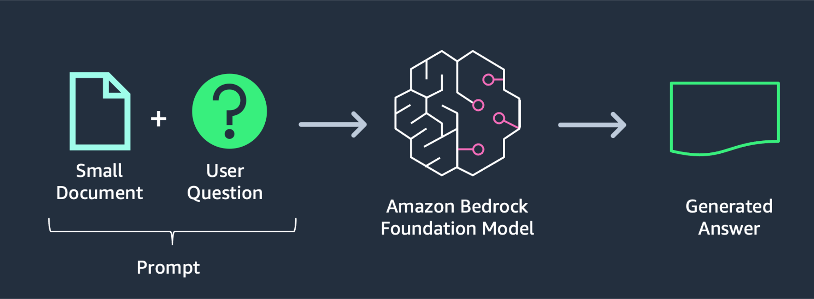

# Overview Study-Assistant
This is a simple demo of Amazon Bedrock and Anthropic Claude 3 Sonnet model with langchain and streamlit. For more detail please reference the following link:  
- <a href="https://aws.amazon.com/bedrock/" target="_blank">https://aws.amazon.com/bedrock/ </a>
- <a href="https://www.anthropic.com/news/claude-3-family" target="_blank">Claude 3 </a>
# To view demo and sample data:
    Access folder demo for demo video
    Access folder samples for sample videos

# To Setup
Setup <a href='https://docs.python-guide.org/starting/install3/linux/' target='_blank'> Python <a> 
Setup <a href='https://docs.python-guide.org/starting/install3/linux/' target='_blank'> Python Env 
Setup <a href='https://docs.aws.amazon.com/cli/latest/userguide/getting-started-quickstart.html' target='_blank'> AWS CLI 
> git clone https://github.com/nguyendinhthi0705/Study-Assistant.git  
> cd Study-Assistant  
> pip3 install -r requirements.txt  
> streamlit run Home.py --server.port 8080  

# Architecture

# Learn more about prompt and Claude 3
<a href="https://docs.anthropic.com/claude/docs/introduction-to-prompt-design" target="_blank">Introduction to prompt design </a>
<a href="https://www-cdn.anthropic.com/de8ba9b01c9ab7cbabf5c33b80b7bbc618857627/Model_Card_Claude_3.pdf">Model Card</a>

# Demo

## A Simple Chat 
]

## Questions and Anwsers
]

## Summary a Lecture
]

## Create Multi Choice Questions
]

## Suggest a Better Writing
]

